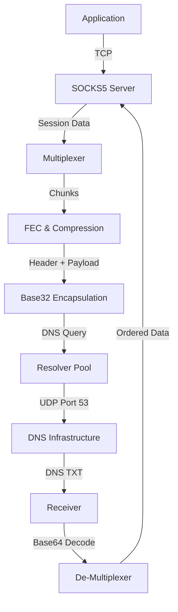

# DNS Tunnel VPN: Client Architecture

The `dnstun-client` is a high-performance SOCKS5 proxy that encapsulates network traffic into DNS queries. It is optimized for speed, reliability, and evading deep packet inspection (DPI).

## 🏗️ 1. High-Level Pipeline

The client operates as a local SOCKS5 server, intercepting TCP connections and multiplexing them over a pool of DNS resolvers using a multipath "Scatter-Gather" engine.

---

## 🔌 2. Protocol Headers (Upstream)

Every DNS query sent by the client contains one or more headers before the payload. These are packed and transformed into a DNS-safe QNAME.

### A. Compact Chunk Header (`chunk_header_t` - 20 Bytes)
Used for every data transmission. It is binary-packed (PRAGMA PACK 1) to ensure zero padding.

| Offset | Size | Field | Description |
| :--- | :--- | :--- | :--- |
| 0 | 1 | `session_id` | 8-bit ID mapping to a specific upstream TCP connection. |
| 1 | 1 | `flags` | Bitmask: `0x01` Encrypted, `0x02` Compressed, `0x04` FEC, `0x08` POLL. |
| 2 | 2 | `seq` | **Upstream Sequence**: 16-bit counter for this session. |
| 4 | 4 | `chunk_info` | Bit 8-15: `fec_k`, Bit 16-31: `total_chunks - 1`. |
| 8 | 8 | `oti_common` | RaptorQ FEC: Common Object Transmission Information (size, symbol size). |
| 16 | 4 | `oti_scheme` | RaptorQ FEC: Scheme-specific parameters (source blocks, sub-blocks). |

### B. Client Capability Header (`capability_header_t` - 7 Bytes)
Prepended to queries when a resolver's state changes or during handshake.

| Offset | Size | Field | Description |
| :--- | :--- | :--- | :--- |
| 0 | 1 | `version` | Protocol version (currently `1`). |
| 1 | 2 | `up_mtu` | Client's determined upstream MTU for this resolver. |
| 3 | 2 | `down_mtu` | Requested downstream MTU for DNS TXT responses. |
| 5 | 1 | `encoding` | Preferred downstream encoding (`0`: Base64, `1`: Hex). |
| 6 | 1 | `loss_pct` | 0-100% observed packet loss per resolver. |

---

## 🔄 3. Sequencing & Reliability

### Upstream Sequencing
The client maintains `tx_next` and `tx_acked` counters per session. 
- **Transmission**: Data is pulled from the socket buffer and wrapped in a `chunk_header_t` with the current `tx_next++`.
- **Sliding Window**: The client will only send up to $N$ unacknowledged packets to avoid overwhelming the server.

### Downstream Reordering
DNS responses often arrive out of order. The client uses a **32-slot Reorder Buffer** (`reorder_buffer_t`):
1.  **Receive**: Extract `seq` from `server_response_header_t`.
2.  **Buffering**: If `seq > expected_seq`, store data in a ring-buffer slot indexed by `seq % 32`.
3.  **Delivery**: If `seq == expected_seq`, write data to the SOCKS5 socket and check if next slots in the buffer are now ready for delivery.

---

## 📡 4. Multipath & Congestion Control

The client uses a **Scatter-Gather** mechanism across a pool of up to 4096 resolvers.

### AIMD Logic (Additive Increase, Multiplicative Decrease)
Each resolver's bandwidth is independently capped by its `cwnd` (congestion window):
- **Success**: If a query returns successfully, `cwnd += 1.0 / cwnd`.
- **Loss**: If a query times out, `cwnd *= 0.5`. This causes the client to rapidly back off from congested or throttled resolvers.

---

## 🕵️ 5. The POLL Mechanism

DNS is a "Pull" protocol—data can only be sent from the server in response to a client query. To receive downstream data when the client has nothing to upload:
- **Timer**: Every 100ms (default), the client fires a **POLL** query across active resolvers.
- **Header**: `chunk_header_t` with `flags |= CHUNK_FLAG_POLL` and empty payload.
- **Result**: The server looks in its downstream buffer for the session ID and returns any waiting data in the TXT response.

---

## 🗜️ 6. Varint Header Compression

To save bytes in the DNS QNAME, small sequence numbers (0-127) are encoded as **Varints**:
- If `seq < 128`, it takes **1 byte**.
- If `seq >= 128`, it takes **2 bytes** (MSB set on first byte).
This ensures that the overhead of the tunnel protocol remains minimal for short-lived sessions.

---

## 🛠️ 7. Advanced Probing & Safety

### MTU Binary Search
The client doesn't guess MTU. It performs a **Binary Search** probe (`128 -> 1500 bytes`) to find the exact point where a resolver starts dropping large DNS queries.
1.  Sends `mtu-req-[size].domain.com`.
2.  Server echoes back a packet of exactly `size` bytes.
3.  Result is stored per-resolver as `upstream_mtu`.

### Zombie/Poison Check
Client performs an NXDOMAIN test against a known non-existent subdomain. If the resolver returns a valid IP (Refined NXDOMAIN interception), the resolver is marked `RSV_ZOMBIE` and blacklisted.
