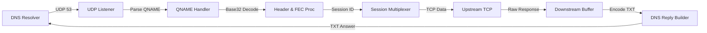

# DNS Tunnel VPN: Server Architecture

The `dnstun-server` acts as the high-performance tunnel endpoint. It handles UDP 53 traffic, parses incoming `QNAME` fields to reconstruct the tunnel stream, and manages asynchronous TCP connections to upstream hosts.

## 🏗️ 1. High-Level Pipeline

The server is built on **libuv**, enabling non-blocking I/O across thousands of concurrent DNS queries.

---

## 👂 2. Protocol Headers (Downstream)

Every DNS response sent by the server contains a header in the `TXT` record, followed by the payload data.

### A. Server Response Header (`server_response_header_t` - 4 Bytes)
This compact header ensures the client can reorder and reconstruct the downstream stream.

| Offset | Size | Field | Description |
| :--- | :--- | :--- | :--- |
| 0 | 1 | `session_id` | 8-bit matching ID for this session (0-255). |
| 1 | 1 | `flags` | Bit 0: `encoding_type` (0=Base64, 1=Hex). Bit 1: `has_sequence` (1 if `seq` is valid). |
| 2 | 2 | `seq` | **Downstream Sequence**: 16-bit counter for this session. |

### B. Handshake Packet (`handshake_packet_t` - 5 Bytes)
Used during session initialization to negotiate MTU and version.

| Offset | Size | Field | Description |
| :--- | :--- | :--- | :--- |
| 0 | 1 | `version` | Protocol version (must match `DNSTUN_VERSION`). |
| 1 | 2 | `up_mtu` | Client's reported upstream MTU for this resolver. |
| 3 | 2 | `down_mtu` | Client's requested downstream MTU for DNS TXT responses. |

---

## 🧩 3. QNAME Normalization & Extraction

DNS queries arrive as dotted labels (e.g., `<base32>.<domain>.`).

### Reconstruction Algorithm:
1.  **Suffix Match**: The server identifies the configured tunnel domain (e.g., `tun.example.com`).
2.  **Label Stripping**: All labels belonging to the domain are removed.
3.  **Concatenation**: Remaining labels are joined into a single contiguous string (STRIPPING dots).
4.  **Base32 Decoding**: The string is converted back to original binary. 

> [!CAUTION]
> If the Base32 payload is less than 20 bytes (size of `chunk_header_t`), the query is silently dropped to prevent malformed packet attacks.

---

## 🏗️ 4. Session Multiplexing & Upstream Host

The server maps 8-bit `session_id` values to individual socket pointers (`uv_tcp_t`).

### Handle Routing:
- **Session Lookup**: `session_find_by_id(uint8_t id)` searches the active `g_sessions` table.
- **Upstream Forwarding**: Data extracted from the `chunk_header_t` payload is immediately written to the session's TCP handle using `uv_write`.
- **Response Buffering**: Data arriving from the upstream host is buffered in `upstream_buf` per session. This buffer grows dynamically via `realloc` as needed.

---

## 📦 5. RaptorQ FEC Reassembly

When the `CHUNK_FLAG_FEC` is set in the incoming header, the server uses a "Symbol Reassembly" logic.

1.  **OTI Extraction**: The server reads `oti_common` and `oti_scheme` from the first symbol of a burst.
2.  **Symbol Buffer**: Symbols are stored in `burst_symbols` (indexed by sequence).
3.  **Completion Check**: Once `burst_received >= burst_count_needed`, the server invokes the `raptorq_decode` library.
4.  **Stream Inject**: The reconstructed source block is then injected back into the session's upstream write pipeline.

---

## 📡 6. Downstream Sequencing Logic

Because the client might fire multiple `POLL` queries, the server must ensure reliable delivery.

1.  **Assigning SEQ**: Every time data is pulled from the `upstream_buf` to respond to a query, the server increments its `downstream_seq`.
2.  **Sequence Header**: `seq` is embedded in the 4-byte `server_response_header_t`.
3.  **Flags**: `RESP_FLAG_HAS_SEQ` is set to notify the client to use its reorder buffer.

---

## 🤝 7. Swarm Management

- **Source IP Tracking**: Every time a valid query arrives, the server records the source IP in its `g_swarm_ips` database.
- **Swarm Sync**: If a client sends a `SYNC` command (payload starts with `"SYNC"`), the server responds with a list of known-good resolver IPs.
- **Persistence**: Swarm state is saved to `server_swarm.txt` every 60 seconds to survive crashes.
