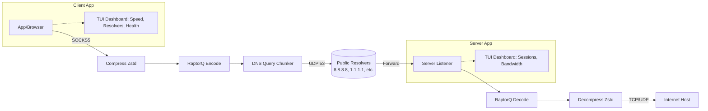

# DNS Tunnel VPN

A DNS tunnel VPN encapsulates arbitrary traffic inside DNS query/response packets. By operating as a **SOCKS5 proxy**, the client becomes entirely cross-platform and user-space (no admin rights or virtual network adapters required).

## Architecture Overview



**Two programs will be built:**
- `dnstun-client` — reads raw IP packets from a TUN device, encodes them as DNS TXT queries and sends them to the server
- `dnstun-server` — receives DNS queries, decodes the payload, forwards the original IP packet to the OS, and wraps the response back in a DNS reply

## User Review Required

> [!WARNING]
> **DNS encoding overhead & FEC**: DNS labels are small. Base32 payload is split across DNS queries. We will use **RaptorQ FEC** to generate redundant symbols, sending extra DNS queries per packet so the server can reassemble the data stream even if some UDP DNS queries are lost by firewalls/ISPs without waiting for TCP retransmits.

> [!TIP]
> **Sliding Window Protocol & Rate-Aware Round Robin**: To eliminate stop-and-wait latency, the client will implement a **sliding window** mechanism keeping multiple DNS queries in flight simultaneously. To avoid getting rate-limited by sending too many requests to a single resolver, queries will be dynamically distributed across a pool of public DNS resolvers using **Weighted Round Robin** combined with **Token Bucket shaping**, strictly enforcing the discovered QPS threshold (Queries Per Second) per resolver.

> [!TIP]
> **Initialization, MTU & Rate-Limit Discovery**: Before starting the SOCKS5 proxy, the client will execute a **testing phase** across the list of resolvers. It will:
> 1. **Authenticity/Hijack Check**: The very first query is a Cryptographic Challenge containing a random nonce sent to the server. If the resolver intercepts the query and returns a generic block-page, a fake IP, or a cached 'zombie' response instead of the exact cryptographically signed response from the Authoritative Tunnel Server, the resolver is marked as Poisoned/Zombie and dropped instantly!
> 2. **Global Swarm Synchronization**: If the config flag is set, the client sends a `SYNC` query to the Server. The Server replies with a chunked list of the IP addresses of every functional resolver it has historically seen from *all* other global clients. This massively populates the starting seed array without manual entry!
> 3. Send dummy queries to benchmark the **Upstream/Downstream MTU** and **RTT (latency)**.
> 4. **CIDR Expansion**: If a config flag is set, any resolver that successfully responds is used as a "seed". The client asynchronously scans the neighboring IP space (e.g. its `/24` subnet) to auto-discover hidden, undocumented resolvers operated by the same provider data center. These pristine nodes are added dynamically to the pool, drastically increasing throughput and evading strict rate limiters!
> 5. Send tests containing raw 8-bit bytes in the TXT response. If the resolver drops or corrupts non-printable characters, it sets a flag to dynamically fallback to **Base64** encoding for that resolver, otherwise utilizing raw **binary bytes** to maximize downstream capacity.
> 5. Perform a **burst stress-test** (gradually increasing queries) to discover the exact rate limit (QPS threshold) where the resolver begins delaying packets or returning `REFUSED`/`SERVFAIL`.
> 6. **Cooldown Measurement**: When a resolver hits its limit during the burst test, the client starts a timer and pings it occasionally to discover its exact **Recovery/Cooldown Duration** (e.g., 60 seconds of silent dropping).
> 7. Send a burst of queries simultaneously to establish the precise **Fail Probability** (Packet Loss Rate) inherent to each resolver path.
> Resolvers that completely fail these checks are moved to a **Dead Pool**.
> 8. **Background Recovery**: A background task periodically trickles test queries to nodes in the Dead Pool (at a user-configured rate, e.g. 5 IPs/sec) checking to see if they've come back online. If a dead node suddenly processes a query successfully, it undergoes the benchmarking suite and is dynamically promoted into the active Round-Robin array!
> 9. **Capability Syncing**: During runtime, every outbound DNS Query sent to a specific generic resolver embeds a lightweight capability header (e.g. `mtu:220,enc:bin,loss:5`) inside the Base32 query name payload. This instructs the **Server** to chunk its corresponding TXT responses up to the absolute *exact physical capability* of the specific resolver the query arrived from, squeezing out maximum throughput without risking packet drops, while simultaneously telling the Server exactly how many **RaptorQ Redundancy Symbols** to generate to recover any lost packets!

> [!TIP]
> **Multipath UDP Scatter-Gather**: To evade rate limits and eliminate stop-and-wait latency, the client replaces sequential requests with a highly aggressive **Multipath sliding window**. It slices the payload into dozens of chunks and blasts them out concurrently across all active resolvers in the pool simultaneously! This aggregates the maximum available bandwidth from every resolver path into a single high-speed flow, effortlessly maximizing the available network limits!

> [!CAUTION]
> **Anti-DPI Obfuscation (Disabled by default / Optional Config)**: Advanced firewalls use machine-learning to detect DNS tunnels by analyzing query intervals and size homogeneity. To disguise the tunnel as ambient internet noise, the client will optionally support:
> - **Multi-Domain Rotation (Optional)**: Configurable list of multiple physical authoritative base domains (e.g., `api.com`, `auth.net`); queries dynamically round-robin the root domain so firewalls don't see 10,000 queries directed at a single base URI.
> - **Timing Jitter (Optional)**: `libuv` introduces a randomized microsecond-jitter to the Token-Bucket dispatch interval, destroying the mathematically perfect rhythm that streaming apps produce.
> - **Chaffing & Padding (Optional)**: Idle tunnel streams generate occasional random-length decoy queries, while standard queries periodically append random-length garbage strings to the payload. These dynamically scramble the query lengths, defeating statistical length-analysis firewalls!

> [!TIP]
> **Payload Compression**: Before routing data into FEC/DNS chunks, the payload stream will be compressed using **Zstd** or **Zlib**. Since DNS payloads are very restrictive, shrinking HTTP/Text traffic through compression drastically lowers the number of DNS queries needed per packet.

> [!TIP]
> **Downstream Data Polling**: Because DNS is fundamentally client-initiated (servers cannot spontaneously push packets downstream to a resolver), the Client maintains an active SOCKS5 session by continuously firing tiny, empty `POLL` queries to the server at a configurable interval **(default 0.1s)**. This provides the Server a constant stream of "return vehicles" to stuff downloading TCP proxy data into, ensuring smooth downstream speeds even when the user isn't actively uploading data!

> [!TIP]
> **Optional Payload Encryption (Disabled by Default)**: If `encryption = true` is set in the config, the entire compressed payload is encrypted **before** FEC and DNS chunking. Supported algorithms:
> - **ChaCha20-Poly1305** (default when enabled): fastest software cipher, AEAD-authenticated, used in WireGuard.
> - **AES-256-GCM** (optional): hardware-accelerated on modern CPUs, AEAD-authenticated.
> Both sides use a **pre-shared key** (`psk`) defined in the config file. A random 12-byte nonce is prepended to each encrypted chunk and discarded after decryption. This makes the tunnel payload completely opaque to any resolver, ISP, or middlebox inspecting the DNS TXT content.

> [!TIP]
> **EDNS0 OPT RR Negotiation**: During the MTU discovery phase, the client sends DNS queries containing an **OPT Resource Record** (Extension Mechanisms for DNS) advertising a UDP payload size of 4096 bytes. Resolvers that support EDNS0 will reply with responses up to that size, dramatically improving downstream chunk capacity. Resolvers that reject OPT RR (returning `FORMERR` or truncating) are automatically flagged and fall back to the raw MTU measured by the basic size probe test.

> [!TIP]
> **Adaptive FEC Ratio (Live Re-calibration)**: Instead of locking in a FEC redundancy ratio `K` at startup, the codec continuously re-evaluates it every **N=32 chunks** during an active proxy stream. It uses a **rolling EWMA (Exponentially Weighted Moving Average)** of the observed loss rate over the last window to compute the optimal K. If loss is 0%, K→0 (no overhead). If loss is 20%, K→25% extra symbols. This maximizes throughput on clean paths while staying resilient on lossy ones.

> [!IMPORTANT]
> **Adaptive Rate Controller (ARC) — AIMD Algorithm**:
> This replaces the rigid Token Bucket with a **network-aware, self-tuning rate controller** using the classic **AIMD (Additive Increase / Multiplicative Decrease)** algorithm used in TCP Cubic and QUIC BBR.
>
> **How it works per resolver:**
> - Each resolver has a `cwnd` (Congestion Window) — the maximum number of in-flight queries allowed at once.
> - **On ACK (successful response)**: `cwnd += 1 / cwnd` — slow, additive growth to find the ceiling without overloading. 
> - **On LOSS / SERVFAIL / Timeout**: `cwnd = cwnd × 0.5` — immediate, multiplicative cut-back to relieve congestion instantly.
> - **On High RTT Variance** (RTT spikes >2× baseline): `cwnd = cwnd × 0.75` — a softer penalty when the resolver is getting slow but not yet dropping.
>
> **Why this beats Token Bucket:**
> A static Token Bucket is set to the QPS limit found at startup. But real networks fluctuate — a resolver might handle 200 QPS at 9am and only 80 QPS at peak hour. ARC *continuously self-tunes* in real-time without needing any configuration. It naturally finds the absolute maximum sustainable rate for each resolver under the *current* network conditions, moment by moment.

> [!TIP]
> **Noise_NK Asymmetric Authentication (Optional)**: Instead of a shared PSK alone, the server can generate a Curve25519 keypair (`--gen-key`). The client embeds the server's public key in its config. All session encryption uses **Noise_NK_25519_ChaChaPoly_BLAKE2s** — the same protocol used by WireGuard. This provides forward-secrecy and identity verification without a CA or TLS certificate infrastructure. PSK mode remains available for simpler setups.

> [!TIP]
> **DoH / DoT Transport Mode (Optional)**: For networks that block raw UDP port 53 (e.g. corporate DPI), the client can encapsulate DNS queries inside **DNS-over-HTTPS (DoH)** or **DNS-over-TLS (DoT)** packets to port 443/853. This makes the tunnel completely indistinguishable from normal encrypted HTTPS traffic to all deep packet inspection hardware.

> [!TIP]
> **DNS Flux — Time-Sliced Deterministic Domain Rotation (Optional)**: When multiple base domains are configured, the client doesn't blindly round-robin. It uses a deterministic, time-based hash (epoch / `flux_period_sec`) to select which domain subset to use for each time window (default 6-hour slices). Both client and server compute the same selection independently — no coordination needed. This spreads traffic across domains unpredictably, making per-domain blocking ineffective.

> [!TIP]
> **OTA Config Push (Optional)**: A background task periodically sends a `CONFIG` query to the server. If the operator has updated any settings, the server replies with a compressed, encrypted config blob embedded in a TXT reply. The client validates the signature and applies the new settings immediately — enabling the operator to update resolver lists, rotate domains, adjust MTU, or push PSK rotations to all clients in the field **without any manual intervention**.

> [!TIP]
> **Chrome DNS Cover Traffic (Optional)**: Generates periodic synthetic DNS bursts that exactly mimic Chromium's real DNS behavior: `A + AAAA + HTTPS` query triplets for well-known domains (Google, YouTube), with the `AD=1` EDNS flag, EDNS0 UDP size 1452, and page-load burst timing (5-15 queries then silence). This makes the combined traffic pattern statistically indistinguishable from a Chrome browser browsing the web to any ML-based DPI classifier.

---

## Proposed Changes

### Component 1 — Project restructure

#### [MODIFY] [CMakeLists.txt](https://github.com/bahramiem/qnsdns/blob/main/CMakeLists.txt)
- Split into two targets: `dnstun-client` and `dnstun-server`
- Keep SPCDNS codec sources shared between both
- Add `FetchContent` for: `libRaptorQ` (FEC), `zstd` (compression), and `libsodium` or `mbedTLS` (ChaCha20-Poly1305 / AES-256-GCM encryption).

---

### Component 2 — Config File (`config.ini`)

#### [NEW] client.ini / server.ini

Both programs read a simple INI-format config file at startup. Every feature is a documented key. Example full client config:

```ini
[core]
socks5_bind       = 127.0.0.1:1080   # SOCKS5 proxy listen address
workers           = 4                # libuv thread pool workers (I/O)
threads           = 2                # Extra processing threads for codec/FEC
log_level         = info             # silent | info | debug

[resolvers]
seed_list         = 8.8.8.8, 1.1.1.1, 9.9.9.9
cidr_scan         = true             # Expand seed /24 subnets for more IPs
cidr_prefix       = 24              # /24 (256 IPs) or /16 (65536 IPs)
swarm_sync        = true             # Download resolver list from server
background_recovery_rate = 5        # IPs/sec to probe Dead Pool

[tuning]
poll_interval_ms  = 100             # Downstream POLL query interval (ms)
fec_window        = 32              # Chunks between adaptive FEC recalculations
cwnd_init         = 16              # Starting congestion window per resolver
cwnd_max          = 512             # Maximum in-flight queries per resolver

[encryption]
enabled           = false            # true = encrypt payload
cipher            = chacha20         # chacha20 | aes256gcm
psk               = changeme         # Pre-shared key (both sides must match)

[obfuscation]
jitter            = false            # Randomize query dispatch timing
padding           = false            # Append random-length garbage to chunks
chaffing          = false            # Emit decoy empty queries when idle
domains           = tun.example.com  # Comma-separated base domains to rotate

[server_sync]
server_domain     = tun.example.com
```

The server reads an equivalent `server.ini` with `[core]` (`workers`, `threads`, `bind`), `[encryption]`, and `[swarm]` (`save_to_disk`, `serve_to_clients`) sections.

---

### Component 2 — Shared encoding library (`tunnel/codec.c/.h`)

#### [NEW] tunnel/codec.h
#### [NEW] tunnel/codec.c

Implements:
- **Compression**: Streams are compressed on the fly (e.g. using Zstd context) to reduce size.
- **RaptorQ FEC**: Encodes the compressed payload into $N$ source symbols + $K$ redundant symbols.
- **Fragment**: split symbols (up to ~180 bytes per DNS query payload) into labelled DNS name segments
- **Sliding Window State**: maintains a transmission window of in-flight sequence numbers, advancing it as ACKs (DNS responses) come back to maximize pipeline throughput and reduce noticeable latency.
- **Assemble**: collect fragment DNS queries by session-ID + sequence number, feed into RaptorQ decoder until enough symbols arrive to recover the payload and decompress it.
- **Base32 encode/decode**: DNS labels are case-insensitive, so base32 is used (avoids case-folding issues with base64)
- **Session ID**: random 4-char prefix per connection to multiplex flows

DNS query domain format:
```
<seq2hex>.<base32_payload_chunk>.<session_id>.tun.<server-domain>
```

---

### Component 3 — Client (`client/main.c`)

#### [NEW] client/main.c

- **Text User Interface (TUI)**: ANSI dashboard with 3 panels:
  - **Stats Panel**: Upload/Download speed (KB/s), active SOCKS5 sessions, total bytes transferred.
  - **Resolver Panel**: Live scrolling table of each resolver (IP, Status: Active/Penalty/Dead, cwnd, RTT ms, QPS, MTU, encoding).
  - **Config Panel** (hotkey `c`): Inline editable fields for all config values. Changes take effect immediately without restart — e.g. toggling `jitter`, changing `poll_interval_ms`, adjusting `cwnd_max`, enabling encryption on-the-fly.
- **Startup Phase**: Iterates through a specified list of initial "seed" public DNS resolvers. If enabled via config, automatically sweeps adjacent `/24` or `/16` CIDR subnets to discover undocumented operational resolvers! Tests the discovered pool for **Authenticity (Cryptographic Check)**, latency (RTT), supported MTU sizes, raw binary vs Base64 TXT compatibility, max Queries-Per-Second (QPS) before rate-limiting occurs, **cooldown duration**, and **fail probability** (natural packet drop rate). Filters out hijacked or underperforming nodes to a Dead Pool and registers the active ones' speed-limits and encoding standards.
- **Background Loop**: Trickles libuv UDP packets to the Dead Pool at a configurable `X` IPs/sec rate to detect if resolvers have recovered.
- Listens locally on `127.0.0.1:1080` (SOCKS5 proxy port).
- Accepts SOCKS5 handshake (CONNECT / UDP ASSOCIATE) from browsers or applications.
- Reads upstream requests (target hostname/IP and port).
- Reads TCP/UDP stream payloads from the local app.
- Encodes the payload using `tunnel/codec.c` with RaptorQ + Zstd compression + sliding window.
- **Encryption (If Enabled)**: Compresses → encrypts (ChaCha20-Poly1305 or AES-256-GCM) → FEC → DNS chunk. Nonce prepended per chunk.
- **Adaptive Rate Controller**: Each resolver runs an independent AIMD congestion window (`cwnd`), growing on ACK and halving on loss/timeout. Replaces the static Token Bucket.
- **Adaptive FEC**: Re-calibrates RaptorQ K every 32 chunks via EWMA loss measurement.
- **Downstream Polling**: If there is no active SOCKS5 upload data to encode, but an established proxy session is expecting a download, the client continuously generates tiny `POLL` chunks every 0.1 seconds (configurable).
- **Multipath UDP Dispatch**: Scatter-gathers concurrent outgoing DNS TXT requests aggressively across all healthy resolvers in parallel. Each resolver's `cwnd` governs its in-flight query count.
- **Obfuscation (If Enabled)**: Outbound queries randomly cycle across configured base domains, randomly pad payload lengths, and jitter timing dispatch to silently evade DPI and Machine-Learning firewall analytics.
- If a resolver flags a rate limit hit, it automatically routes around it via the **Penalty Box** timer.
- Sends DNS queries asynchronously and completely block-free via libuv UDP to the active resolver pool.
- Reassembles DNS responses and writes them back to the local SOCKS5 client socket.

---

### Component 4 — Server (`server/main.c`)

#### [NEW] server/main.c

- **Text User Interface (TUI)**: Paints a real-time dashboard revealing inbound tunnel sessions, active aggregated bandwidth, multiplexing stats, and connection errors.
- **Resolver Swarm Database**: The server inspects the UDP Source IP of every incoming authenticated payload query. It adds these proven, functional IP addresses to a continuous in-memory Swarm database (saving it to disk optionally).
- Listens on UDP port 53 using libuv.
- Receives DNS queries, **decrypts payload (if encryption enabled)**, extracts the embedded **downstream MTU size**, **encoding format (Binary/Base64)**, and **fail probability** flags dynamically parsed from the client's query header along with the encoded SOCKS5 payload using `tunnel/codec.c`.
- **Adaptive FEC Reply**: When generating TXT responses, computes RaptorQ K based on the live EWMA loss rate reported in the query header, not just the startup value.
- Reassembles SOCKS5 commands and raw payload streams from fragments. If the payload is a `SYNC` command, it responds by encoding and serving the entire Resolver Swarm Database back to the querying Client!
- Establishes outbound proxy connections to the target IP/Domain via libuv (`uv_tcp_connect` / `uv_udp_send`).
- **Encrypts response (If encryption enabled)** before wrapping into DNS TXT reply.
- Forwards the internet response back to the client wrapped into a DNS TXT reply using FEC.

---

## Verification Plan

### Build Verification
```
# From build directory
cmd.exe /c compile.bat
```
Expected: both `dnstun-client.exe` and `dnstun-server.exe` build without errors across Windows/Linux using CMake.

### Manual SOCKS5 Functional Test
1. Run `dnstun-server` on a Linux VPS (or locally mapped port) on UDP port 53.
2. Run `dnstun-client.exe` locally. It opens `127.0.0.1:1080`.
3. Test using curl: `curl -x socks5h://127.0.0.1:1080 http://example.com`
4. The HTML for example.com should load successfully via DNS queries.

> [!NOTE]
> Full end-to-end test requires a VPS. Unit tests for the codec (encode/decode round-trip) will be written as a standalone `test_codec` target you can run locally without a server.

### Codec Unit Test
```
# Run the standalone codec test binary
.\build\Desktop_Qt_6_10_2_MinGW_64_bit-Debug\test_codec.exe
```
Verifies: fragment → base32 encode → DNS name → base32 decode → reassemble produces the original packet bytes.
