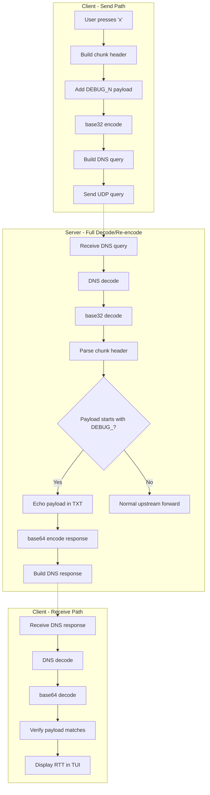

# Debug Protocol Test Feature - Implementation Plan

## Overview
Add a TUI page that sends a specific debug message to the server when 'x' is pressed. The server loops it back so the client can verify the packet protocol is working correctly.

## Architecture

The debug packet goes through the **full encode/decode pipeline** to test the entire protocol stack:



**Key Point**: The debug packet uses the NORMAL data path through all codec layers (chunk → base32 → DNS → server → base64 TXT → client). The server recognizes the special "DEBUG_" payload prefix and echoes it back instead of forwarding upstream.

## Changes Required

### 1. shared/types.h
Add new flag for debug packets (optional - can also just use payload marker):
```c
#define CHUNK_FLAG_DEBUG      0x10  /* Debug/loopback test packet - optional */
```

**Note**: Instead of a special flag, we can use a payload prefix "DEBUG_" which goes through the normal encoding/decoding path. This tests the full stack better.

### 2. shared/tui.h
Add protocol test state to TUI context:
```c
typedef struct {
    uint64_t last_test_sent_ms;
    uint64_t last_test_recv_ms;
    bool     test_pending;
    bool     last_test_success;
    uint32_t test_sequence;
    char     test_payload[64];
} tui_proto_test_t;

/* In tui_ctx_t, add: */
tui_proto_test_t  proto_test;
void (*send_debug_cb)(struct tui_ctx *t, const char *payload, uint32_t seq);
```

Also add a new panel constant:
```c
#define TUI_PANEL_PROTO_TEST 4
```

### 3. shared/tui.c

#### 3.1 Add render function for protocol test panel:
```c
static void render_proto_test(tui_ctx_t *t) {
    printf(ANSI_BOLD ANSI_CYAN " ▌ PROTOCOL TEST ▌" ANSI_RESET "\n");
    hr(72, ANSI_CYAN);
    
    printf(" Press [x] to send debug packet to server\n\n");
    
    tui_proto_test_t *pt = &t->proto_test;
    
    if (pt->last_test_sent_ms == 0) {
        printf(" No test performed yet.\n");
    } else {
        printf(" Last test:\n");
        printf("   Sequence:  %u\n", pt->test_sequence);
        printf("   Payload:   %s\n", pt->test_payload);
        printf("   Sent:      +%llums\n", pt->last_test_sent_ms);
        
        if (pt->test_pending) {
            printf("   Status:    " ANSI_YELLOW "PENDING" ANSI_RESET "\n");
        } else if (pt->last_test_success) {
            uint64_t rtt = pt->last_test_recv_ms - pt->last_test_sent_ms;
            printf("   Status:    " ANSI_GREEN "SUCCESS" ANSI_RESET "\n");
            printf("   RTT:       " ANSI_GREEN "%llums" ANSI_RESET "\n", rtt);
        } else {
            printf("   Status:    " ANSI_RED "FAILED/TIMEOUT" ANSI_RESET "\n");
        }
    }
    
    hr(72, ANSI_CYAN);
    printf(ANSI_BOLD " [1] Stats   [2] Resolvers   [3] Config   [4] Debug   "
           ANSI_CYAN "[5]" ANSI_RESET ANSI_BOLD " Proto Test   [q] Quit\n" ANSI_RESET);
}
```

#### 3.2 Add key handler for 'x' in panel 4:
In `tui_handle_key()`, add:
```c
case '5': t->panel = 4; break;  /* Protocol test panel */

/* In panel 4 (proto test) specific handling: */
if (t->panel == 4 && key == 'x') {
    /* Send debug packet */
    t->proto_test.test_sequence++;
    snprintf(t->proto_test.test_payload, sizeof(t->proto_test.test_payload),
             "DEBUG_%u", t->proto_test.test_sequence);
    t->proto_test.last_test_sent_ms = uv_hrtime() / 1000000ULL;
    t->proto_test.test_pending = true;
    t->proto_test.last_test_success = false;
    
    if (t->send_debug_cb) {
        t->send_debug_cb(t, t->proto_test.test_payload, t->proto_test.test_sequence);
    }
}
```

### 4. client/main.c

#### 4.1 Implement send_debug_packet callback:
```c
static void on_debug_packet_sent(tui_ctx_t *t, const char *payload, uint32_t seq) {
    /* Build and send a debug packet through the NORMAL pipeline */
    /* This tests: chunk encode → base32 → DNS query → server */
    
    /* Use a reserved session ID (e.g., 15) for debug packets */
    uint8_t debug_session = 15;
    
    chunk_header_t hdr = {0};
    chunk_set_session_id(&hdr.flags, debug_session);
    hdr.seq = (uint16_t)(seq & 0xFFFF);
    hdr.chunk_info = 0;  /* Single chunk, no FEC, no compression, no encryption */
    
    /* Build payload: "DEBUG_<seq>_<timestamp>" */
    char debug_payload[64];
    snprintf(debug_payload, sizeof(debug_payload), "DEBUG_%u_%llu", 
             seq, uv_hrtime() / 1000000ULL);
    
    /* Use existing send path: build_dns_query() or fire_dns_query() */
    /* This ensures base32 encoding and DNS packaging is tested */
    send_debug_dns_query(&hdr, (uint8_t*)debug_payload, strlen(debug_payload));
}
```

#### 4.2 Add handling for debug response in on_dns_recv:
The client receives the response through the **normal base64 decode path**:

```c
/* In on_dns_recv() - after normal base64 decode of TXT response */
/* The decoded data comes from base64_decode(decoded, ans->txt.text, ans->txt.len) */

if (g_tui.proto_test.test_pending && decoded_len > 0) {
    /* Check if response starts with DEBUG_ */
    if (decoded_len >= 6 && memcmp(decoded, "DEBUG_", 6) == 0) {
        /* Extract sequence number from response: "DEBUG_<seq>_<timestamp>" */
        uint32_t recv_seq = 0;
        sscanf((char*)decoded, "DEBUG_%u", &recv_seq);
        
        if (recv_seq == g_tui.proto_test.test_sequence) {
            g_tui.proto_test.last_test_recv_ms = uv_hrtime() / 1000000ULL;
            g_tui.proto_test.test_pending = false;
            g_tui.proto_test.last_test_success = true;
            LOG_INFO("Debug packet loopback successful: RTT=%llums\n",
                     g_tui.proto_test.last_test_recv_ms - g_tui.proto_test.last_test_sent_ms);
        }
    }
}
```

**Full Stack Tested**:
1. ✓ Chunk header encoding/decoding
2. ✓ Base32 encoding (client → server)
3. ✓ DNS query packaging
4. ✓ DNS response parsing
5. ✓ Base64 encoding (server → client)  
6. ✓ Base64 decoding (client receive)

#### 4.3 Register callback in tui_init:
```c
g_tui.send_debug_cb = on_debug_packet_sent;
```

### 5. server/main.c

#### 5.1 Add debug packet handling in on_server_recv:
The server uses the **normal decode path** and detects debug packets by payload prefix:

```c
/* After base32 decode and chunk header parse (normal path) */
/* chunk_header_t hdr and payload are already decoded */

/* Check if this is a debug packet by payload prefix */
bool is_debug = (payload_len >= 6 && memcmp(payload, "DEBUG_", 6) == 0);

if (is_debug) {
    /* Echo the payload back through the NORMAL encode path */
    /* This tests: server → base64 encode → DNS TXT response → client */
    
    uint8_t reply[512];
    size_t rlen = sizeof(reply);
    
    /* Use existing build_txt_reply which does base64 encoding */
    /* The client will need to base64 decode (normal path) */
    if (build_txt_reply(reply, &rlen, query_id, qname,
                        payload, payload_len, 512) == 0) {
        send_udp_reply(src, reply, rlen);
        LOG_DEBUG("Debug packet echoed back to %s (payload=%.*s)\n",
                  src_ip, (int)payload_len, payload);
    }
    return;  /* Don't process further - no upstream forwarding */
}
```

**Key**: The debug packet flows through the same codec layers as real data:
- Client: chunk → base32 → DNS query
- Server: DNS decode → base32 decode → detect → base64 encode → DNS response  
- Client: DNS decode → base64 decode → verify payload

## Protocol Details

### Debug Packet Format
- **Session ID**: Reserved session 15 (or any non-conflicting ID)
- **Flags**: Normal flags (no encryption, no compression for simplicity)
- **Sequence**: Incrementing number for tracking  
- **Payload**: `"DEBUG_<seq>_<timestamp>"` - ASCII text for easy verification
- **Client → Server**: chunk header + payload → base32 → DNS QNAME
- **Server → Client**: payload → base64 → DNS TXT record

### Full Codec Pipeline Tested

| Direction | Encoding Steps |
|-----------|---------------|
| Client → Server | Chunk header (4 bytes) + payload → base32 encode → DNS QNAME query |
| Server → Client | Payload → base64 encode → DNS TXT response |

### Timing
- Client records send time before `uv_udp_send()`
- Server immediately echoes (no upstream forwarding, no session state needed)
- Client records receive time after `base64_decode()` in `on_dns_recv()`
- RTT = receive_time - send_time

### Why This Tests the Full Stack

Instead of a special flag that bypasses encoding, the debug packet:
1. Uses **normal chunk encoding** (header + payload)
2. Goes through **base32 encoding** (client outbound)
3. Gets packaged in **DNS query** (client → resolver → server)
4. Server **decodes DNS** and **base32 decodes** (normal path)
5. Server **base64 encodes** into TXT response (normal response path)
6. Client **decodes DNS** and **base64 decodes** (normal receive path)

If any layer is broken (chunk format, base32, DNS packaging, base64), the test fails.

## UI Layout (Panel 4)

```
 ▌ PROTOCOL TEST ▌
------------------------------------------------------------------------
 Press [x] to send debug packet to server

 Last test:
   Sequence:  42
   Payload:   DEBUG_42
   Sent:      +1234567ms
   Status:    SUCCESS
   RTT:       45ms

------------------------------------------------------------------------
 [1] Stats   [2] Resolvers   [3] Config   [4] Debug   [5] Proto Test   [q] Quit
```

## Implementation Notes

1. **Session Handling**: Debug packets use a reserved session ID (15) to avoid conflicting with real SOCKS5 sessions (0-15 available, pick one that's unlikely to be in use)
2. **Security**: Debug packets are only for testing; payload is plaintext "DEBUG_..."
3. **Timeout**: If no response in 5 seconds, mark test as failed (use `uv_timer_t`)
4. **Resolver Selection**: Use any active resolver for sending debug packets
5. **Payload Size**: Keep debug payload small (< 50 bytes) to ensure it fits in QNAME after base32 encoding
6. **No Special Flags**: Uses payload prefix detection instead of special header flags to ensure full codec path is exercised

## Codec Layer Verification

The debug packet tests these specific codec functions:

| Function | File | Purpose |
|----------|------|---------|
| `build_dns_query()` | client/main.c | Chunk + base32 + DNS packaging |
| `base32_encode()` | shared/base32.c | Client outbound encoding |
| `base32_decode()` | server/main.c | Server inbound decoding |
| `build_txt_reply()` | server/main.c | base64 + DNS response |
| `base64_decode()` | client/main.c | Client inbound decoding |
| `dns_encode()` / `dns_decode()` | SPCDNS/codec.c | DNS wire format |

## Testing Steps

1. Start server
2. Start client with TUI
3. Press '5' to navigate to Protocol Test panel
4. Press 'x' to send debug packet
5. Verify success message appears with RTT
6. Stop server and verify timeout/failure handling
