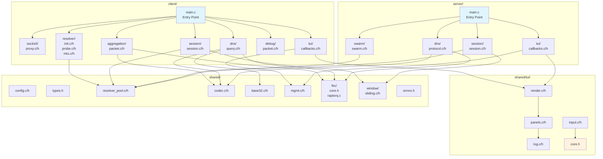

# Code Refactoring Plan: Modular Architecture

## Overview

This plan refactors the large monolithic `server/main.c` (58KB, ~1400 lines) and `client/main.c` (136KB, ~3100+ lines) files into a modular, human-readable directory structure.

## Current State

```
server/
  main.c          (58KB - too large)

client/
  main.c          (136KB - way too large)

shared/
  tui.c           (45KB - also large)
```

## Target Architecture

```
server/
  main.c              (minimal entry point, ~200 lines)
  session/
    session.c         (session lifecycle, upstream TCP)
    session.h         (srv_session_t, session_* functions)
  swarm/
    swarm.c           (resolver IP tracking, persistence)
    swarm.h           (swarm_* functions)
  dns/
    protocol.c        (TXT reply building, encoding)
    protocol.h        (build_txt_reply_with_seq)
  tui/
    callbacks.c       (timer callbacks, TTY handling)
    callbacks.h

client/
  main.c              (minimal entry point, ~300 lines)
  socks5/
    proxy.c           (SOCKS5 server, connection handling)
    proxy.h           (socks5_* functions, on_socks5_*)
  dns/
    query.c           (DNS query building, inline_dotify)
    query.h           (build_dns_query, fire_dns_*)
  session/
    session.c         (reorder buffer, session state)
    session.h         (reorder_buffer_*, session_t)
  resolver/
    init.c            (resolver initialization phase)
    init.h            (resolver_init_phase)
    probe.c           (probe handling, test probes)
    probe.h
    mtu.c             (MTU binary search testing)
    mtu.h
  aggregation/
    packet.c          (packet aggregation, encode/decode)
    packet.h          (agg_packet_*, aggregation functions)
  debug/
    packet.c          (debug packet handling)
    packet.h          (on_debug_* functions)
  tui/
    callbacks.c       (timer callbacks, TTY handling)
    callbacks.h

shared/
  tui/
    core.h            (common TUI types, moved from tui.h)
    render.c          (tui_render, panel rendering)
    render.h
    input.c           (keyboard handling, menu navigation)
    input.h
    panels.c          (stats, resolvers, config, debug panels)
    panels.h
    log.c             (debug log buffer)
    log.h
    ansi.h            (ANSI escape codes - extracted from tui.c)
  fec/
    core.h            (fec_encode, fec_decode abstract interface)
    raptorq.c         (RaptorQ implementation)
    reedsolomon.c     (Future Reed-Solomon implementation)
  window/
    sliding.c         (Sliding window tracking, sequence management)
    sliding.h
  errors.h            (Unified error code definitions)

tests/
  fec_tests.c         (Unit tests for FEC algorithms)
  window_tests.c      (Unit tests for sliding window logics)
```

## Architecture Diagram



## Module Responsibilities

### UI Decoupling (Future-Proofing for Windows/Android)

To make it easy to replace the TUI with a native Android or Windows GUI in the future:
1. **Headless Core**: The networking core (`session`, `dns`, `socks5`, etc.) must NEVER include UI headers or call screen-drawing functions directly.
2. **State Context**: The core logic should ONLY update numerical statistics and string states inside a centralized struct (e.g., `app_context_t`).
3. **Swappable Interface**: The `tui` module acts as a "View" layer that reads from the `app_context_t` struct on a timer and renders it to the screen. To port to Android, the `tui` folder is simply excluded from the Android build, leaving the core intact.

### Server Modules

| Module | Responsibility | Functions/Types |
|--------|----------------|-----------------|
| `session/` | Session lifecycle management | `srv_session_t`, `session_find_by_id`, `session_alloc_by_id`, `session_close`, upstream TCP handling |
| `swarm/` | Resolver IP tracking | `swarm_record_ip`, `swarm_save`, `swarm_load` |
| `dns/` | DNS protocol handling | `build_txt_reply_with_seq`, `encode_downstream_data`, `on_server_recv` |
| `tui/` | TUI integration | `on_tui_timer`, `on_idle_timer`, `get_active_clients`, TTY callbacks |

### Client Modules

| Module | Responsibility | Functions/Types |
|--------|----------------|-----------------|
| `socks5/` | SOCKS5 proxy server | `socks5_*`, `on_socks5_*`, `socks5_handle_data` |
| `dns/` | DNS query building | `build_dns_query`, `inline_dotify`, `fire_dns_chunk_symbol` |
| `session/` | Session state & reordering | `session_t`, `reorder_buffer_*` |
| `resolver/` | Resolver initialization & testing | `resolver_init_phase`, probe functions, MTU binary search |
| `aggregation/` | Packet aggregation | `agg_packet_*`, `encode_aggregated_packet`, `decode_aggregated_packet` |
| `debug/` | Debug packet handling | `on_debug_*`, debug packet functions |
| `tui/` | TUI integration | Timer callbacks, TTY handling |

### Shared TUI Modules

| Module | Responsibility |
|--------|----------------|
| `render.c` | `tui_render`, screen clearing, cursor control |
| `input.c` | Keyboard handling, menu navigation, input mode |
| `panels.c` | Stats panel, resolvers panel, config panel, debug panel, help panel |
| `log.c` | Debug log buffer management |
| `core.h` | Common TUI types (moved from tui.h) |
| `ansi.h` | ANSI escape codes (extracted constants) |

### Shared FEC Modules (Replaceable Error Correction)

To support multiple Forward Error Correction algorithms (e.g., RaptorQ, Reed-Solomon):
1. **Abstract Interface**: `shared/fec/core.h` defines generic functions (`fec_encoder_init`, `fec_encode`, `fec_decode`).
2. **Pluggable Backends**: Implementations like `raptorq.c` and `reedsolomon.c` export structs conforming to the abstract interface.
3. **No Hardcoding**: `server/dns/protocol.c` and `client/aggregation/packet.c` use the generic `fec_*` functions instead of calling RaptorQ directly.

### Shared Windowing & Flow Control

To ensure sequence tracking, reorder buffering, and sliding windows are unified between client and server:
1. **`sliding.c`**: Manages sliding window limits, ACK tracking, and sequence verification.
2. **`session` Abstraction**: `client/session/session.c` and `server/session/session.c` will no longer reinvent reorder buffers, instead they will initialize a `window_t` struct and push/pull packets from it.

### Standardized Error Handling

1. **Unified Format**: All modules MUST return standardized error codes defined in `shared/errors.h` (e.g., `enum qns_err { QNS_OK, QNS_ERR_TIMEOUT, QNS_ERR_FEC_DECODE, ... }`).
2. **Graceful Degradation**: Avoid raw integers or silent `exit(1)` failures within isolated modules. Let the core application context decide how to handle failures.

### Unit Testing (`tests/`)

1. **Fast Verification**: Key mathematical and structural logic (FEC, Sliding Windows, Codecs) must be decoupled entirely from network sockets so they can be tested locally using `tests/*_tests.c`.
2. **Test Framework**: Use standard C `assert()` or a lightweight test framework. These tests will be integrated into the CMake build target so regressions are caught immediately.

## File Size Targets

| File | Current | Target |
|------|---------|--------|
| `server/main.c` | 58KB (~1400 lines) | ~5KB (~200 lines) |
| `server/session/session.c` | - | ~15KB |
| `server/swarm/swarm.c` | - | ~5KB |
| `server/dns/protocol.c` | - | ~12KB |
| `server/tui/callbacks.c` | - | ~8KB |
| `client/main.c` | 136KB (~3100 lines) | ~8KB (~300 lines) |
| `client/socks5/proxy.c` | - | ~25KB |
| `client/dns/query.c` | - | ~15KB |
| `client/session/session.c` | - | ~20KB |
| `client/resolver/init.c` | - | ~25KB |
| `client/resolver/probe.c` | - | ~15KB |
| `client/resolver/mtu.c` | - | ~12KB |
| `client/aggregation/packet.c` | - | ~15KB |
| `client/debug/packet.c` | - | ~8KB |
| `shared/tui.c` | 45KB | Removed (split into modules) |
| `shared/tui/*.c` | - | ~10KB each |
| `shared/window/sliding.c` | - | ~10KB |

## Dependency Flow

```
server/main.c
  ├─> server/session/session.h
  ├─> server/swarm/swarm.h
  ├─> server/dns/protocol.h
  ├─> server/tui/callbacks.h
  └─> shared/config.h, shared/types.h, etc.

client/main.c
  ├─> client/socks5/proxy.h
  ├─> client/dns/query.h
  ├─> client/session/session.h
  ├─> client/resolver/init.h
  ├─> client/aggregation/packet.h
  ├─> client/debug/packet.h
  ├─> client/tui/callbacks.h
  └─> shared/config.h, shared/types.h, etc.

shared/tui/*.c
  └─> shared/tui/core.h
```

## Build System Updates

The `CMakeLists.txt` will need updates to:

1. Add new include directories:
   - `server/session/`, `server/swarm/`, `server/dns/`, `server/tui/`
   - `client/socks5/`, `client/dns/`, `client/session/`, `client/resolver/`, `client/aggregation/`, `client/debug/`, `client/tui/`
   - `shared/tui/`

2. Add new source files to the respective targets

## Migration Strategy

To ensure system stability, this refactoring must be incremental. The build must succeed and tests must pass after each phase.

1. **Phase 1: Foundation & Shared UI** 
   - Create directory structure.
   - Refactor `shared/tui.c` into `shared/tui/` modules.
   - Update `CMakeLists.txt` for the shared changes.
   - **Verification**: Compile and run to ensure the UI still renders correctly.

2. **Phase 2: Server Refactoring**
   - Extract server modules iteratively: `session` → `swarm` → `dns` → `tui`.
   - Update `CMakeLists.txt` for server changes.
   - **Verification**: Compile server and verify SOCKS5 handshake and proxy functions work.

3. **Phase 3: Client Refactoring**
   - Extract client modules iteratively: `socks5` → `dns` → `session` → `resolver` → `aggregation` → `debug` → `tui`.
   - Update `CMakeLists.txt` for client changes.
   - **Verification**: Compile client and run end-to-end tunnel tests.

4. **Phase 4: Final Polish**
   - Remove dead code and legacy structs.
   - Resolve any cyclic dependencies.
   - Final end-to-end load testing to ensure no performance regressions.

## Code Documentation Standards (Junior-Friendly)

To ensure this project is accessible and understandable to junior programmers:
1. **Top-of-File Examples**: Every single `.c` and `.h` file MUST start with a block comment explaining what the file does, why it exists, and a simple pseudo-code **example** of how to use its main functions.
2. **Human-Readable Comments**: Avoid overly terse or strictly academic language. Explain *why* the code is doing something, not just *what* it is doing, especially for bitwise operations or complex network flows like FEC or sliding windows.
3. **Clear Naming Conventions**: Do not abbreviate variables unnecessarily (e.g., use `connection_timeout` instead of `cto`).
4. **Step-by-Step Logic**: For complex functions, break the logic into numbered steps inside the comments (e.g., `// 1. Verify connection status`).
5. **Doxygen CI/CD**: All block comments and signatures must adhere to Doxygen standards. A build step will be added to `.github/workflows` to auto-generate a static HTML site hosting this documentation so backend logic is easily searchable for all contributors.

## Notes for AI Agents

- **Incremental Commits**: Commit or verify after each logical module extraction. Do not attempt to refactor the entire client or server in a single step.
- **Single Responsibility**: Each module should have a clear, single responsibility.
- **Headers & Includes**: Use forward declarations in headers to minimize includes. Avoid circular dependencies.
- **Global State**: Keep global state minimal; prefer passing context pointers (like `app_context_t`) to functions.
- **Signatures**: Maintain existing function signatures to minimize changes across the codebase.
- **Documentation**: Add module-level documentation Doxygen-style headers to new files, strictly adhering to the "Junior-Friendly" standards outlined above.
- **Parallel Safety**: Ensure thread safety and mutex locks are preserved verbatim during extraction. Watch out for global variables moved to static module variables.
