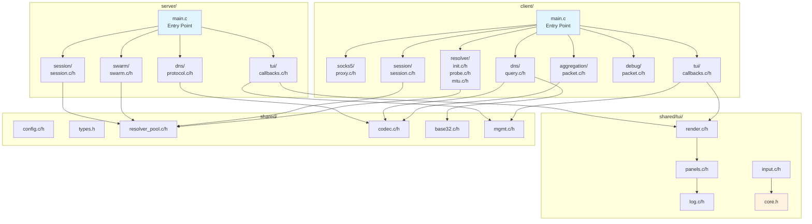

# Code Refactoring Plan: Modular Architecture

## Overview

This plan refactors the large monolithic `server/main.c` (58KB, ~1400 lines) and `client/main.c` (136KB, ~3100+ lines) files into a modular, human-readable directory structure.

## Current State

```
server/
  main.c          (58KB - too large)

client/
  main.c          (136KB - way too large)

shared/
  tui.c           (45KB - also large)
```

## Target Architecture

```
server/
  main.c              (minimal entry point, ~200 lines)
  session/
    session.c         (session lifecycle, upstream TCP)
    session.h         (srv_session_t, session_* functions)
  swarm/
    swarm.c           (resolver IP tracking, persistence)
    swarm.h           (swarm_* functions)
  dns/
    protocol.c        (TXT reply building, encoding)
    protocol.h        (build_txt_reply_with_seq)
  tui/
    callbacks.c       (timer callbacks, TTY handling)
    callbacks.h

client/
  main.c              (minimal entry point, ~300 lines)
  socks5/
    proxy.c           (SOCKS5 server, connection handling)
    proxy.h           (socks5_* functions, on_socks5_*)
  dns/
    query.c           (DNS query building, inline_dotify)
    query.h           (build_dns_query, fire_dns_*)
  session/
    session.c         (reorder buffer, session state)
    session.h         (reorder_buffer_*, session_t)
  resolver/
    init.c            (resolver initialization phase)
    init.h            (resolver_init_phase)
    probe.c           (probe handling, test probes)
    probe.h
    mtu.c             (MTU binary search testing)
    mtu.h
  aggregation/
    packet.c          (packet aggregation, encode/decode)
    packet.h          (agg_packet_*, aggregation functions)
  debug/
    packet.c          (debug packet handling)
    packet.h          (on_debug_* functions)
  tui/
    callbacks.c       (timer callbacks, TTY handling)
    callbacks.h

shared/
  tui/
    core.h            (common TUI types, moved from tui.h)
    render.c          (tui_render, panel rendering)
    render.h
    input.c           (keyboard handling, menu navigation)
    input.h
    panels.c          (stats, resolvers, config, debug panels)
    panels.h
    log.c             (debug log buffer)
    log.h
    ansi.h            (ANSI escape codes - extracted from tui.c)
```

## Architecture Diagram



## Module Responsibilities

### Server Modules

| Module | Responsibility | Functions/Types |
|--------|----------------|-----------------|
| `session/` | Session lifecycle management | `srv_session_t`, `session_find_by_id`, `session_alloc_by_id`, `session_close`, upstream TCP handling |
| `swarm/` | Resolver IP tracking | `swarm_record_ip`, `swarm_save`, `swarm_load` |
| `dns/` | DNS protocol handling | `build_txt_reply_with_seq`, `encode_downstream_data`, `on_server_recv` |
| `tui/` | TUI integration | `on_tui_timer`, `on_idle_timer`, `get_active_clients`, TTY callbacks |

### Client Modules

| Module | Responsibility | Functions/Types |
|--------|----------------|-----------------|
| `socks5/` | SOCKS5 proxy server | `socks5_*`, `on_socks5_*`, `socks5_handle_data` |
| `dns/` | DNS query building | `build_dns_query`, `inline_dotify`, `fire_dns_chunk_symbol` |
| `session/` | Session state & reordering | `session_t`, `reorder_buffer_*` |
| `resolver/` | Resolver initialization & testing | `resolver_init_phase`, probe functions, MTU binary search |
| `aggregation/` | Packet aggregation | `agg_packet_*`, `encode_aggregated_packet`, `decode_aggregated_packet` |
| `debug/` | Debug packet handling | `on_debug_*`, debug packet functions |
| `tui/` | TUI integration | Timer callbacks, TTY handling |

### Shared TUI Modules

| Module | Responsibility |
|--------|----------------|
| `render.c` | `tui_render`, screen clearing, cursor control |
| `input.c` | Keyboard handling, menu navigation, input mode |
| `panels.c` | Stats panel, resolvers panel, config panel, debug panel, help panel |
| `log.c` | Debug log buffer management |
| `core.h` | Common TUI types (moved from tui.h) |
| `ansi.h` | ANSI escape codes (extracted constants) |

## File Size Targets

| File | Current | Target |
|------|---------|--------|
| `server/main.c` | 58KB (~1400 lines) | ~5KB (~200 lines) |
| `server/session/session.c` | - | ~15KB |
| `server/swarm/swarm.c` | - | ~5KB |
| `server/dns/protocol.c` | - | ~12KB |
| `server/tui/callbacks.c` | - | ~8KB |
| `client/main.c` | 136KB (~3100 lines) | ~8KB (~300 lines) |
| `client/socks5/proxy.c` | - | ~25KB |
| `client/dns/query.c` | - | ~15KB |
| `client/session/session.c` | - | ~20KB |
| `client/resolver/init.c` | - | ~25KB |
| `client/resolver/probe.c` | - | ~15KB |
| `client/resolver/mtu.c` | - | ~12KB |
| `client/aggregation/packet.c` | - | ~15KB |
| `client/debug/packet.c` | - | ~8KB |
| `shared/tui.c` | 45KB | Removed (split into modules) |
| `shared/tui/*.c` | - | ~10KB each |

## Dependency Flow

```
server/main.c
  ├─> server/session/session.h
  ├─> server/swarm/swarm.h
  ├─> server/dns/protocol.h
  ├─> server/tui/callbacks.h
  └─> shared/config.h, shared/types.h, etc.

client/main.c
  ├─> client/socks5/proxy.h
  ├─> client/dns/query.h
  ├─> client/session/session.h
  ├─> client/resolver/init.h
  ├─> client/aggregation/packet.h
  ├─> client/debug/packet.h
  ├─> client/tui/callbacks.h
  └─> shared/config.h, shared/types.h, etc.

shared/tui/*.c
  └─> shared/tui/core.h
```

## Build System Updates

The `CMakeLists.txt` will need updates to:

1. Add new include directories:
   - `server/session/`, `server/swarm/`, `server/dns/`, `server/tui/`
   - `client/socks5/`, `client/dns/`, `client/session/`, `client/resolver/`, `client/aggregation/`, `client/debug/`, `client/tui/`
   - `shared/tui/`

2. Add new source files to the respective targets

## Migration Strategy

1. **Phase 1**: Create directory structure
2. **Phase 2**: Extract server modules (session → swarm → dns → tui)
3. **Phase 3**: Extract client modules (socks5 → dns → session → resolver → aggregation → debug → tui)
4. **Phase 4**: Extract shared/tui modules
5. **Phase 5**: Update CMakeLists.txt
6. **Phase 6**: Compile and fix issues

## Notes for AI Agents

- Each module should have a clear, single responsibility
- Use forward declarations in headers to minimize includes
- Keep global state minimal; prefer passing context pointers
- Maintain existing function signatures to minimize changes
- Add module-level documentation headers
- Ensure thread safety is preserved during extraction
